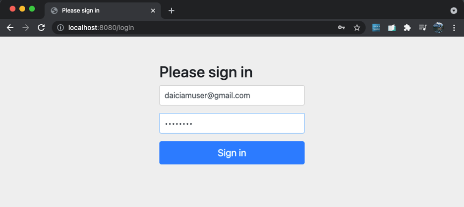
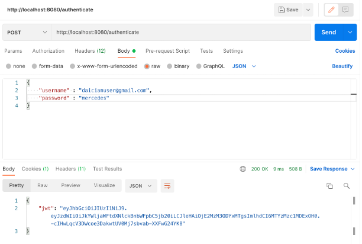
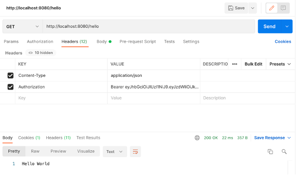
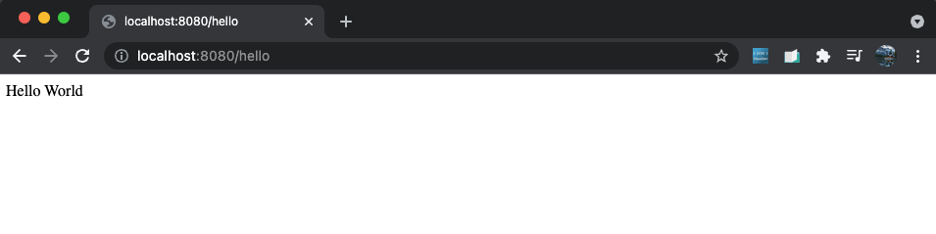

# Getting Started

### Development Steps

1. Initialize a new project using start.spring.io
   1. Maven Project
   2. Java Language
   3. Add Dependencies

2. Define a REST controller that will accept users web requests
3. Create a UserDetailsService that returns authenticated user credentials
4. Open a landing page with a login form to validate the authenticated user credentials
5. Return a Json Web Token if user is authenticated and redirect to protected web page (/hello)

### Deployment Steps

1. Download ZIP file from GitHub repo
2. Docker ...
3. Tests ...

### Intended User Work Flow:

1. localhost:8080/login [GET]:

2. localhost:8080/authenticate [POST]:

3. localhost:8080/hello [GET]:

### Other Notes

After a quick chat with Naz, I realized that this is a challenging coding exercise which may not be easy to have a fully functioning solution in under a week. 
Rather, this exercise is more about the learning process of working with new technology and developing research skills to find open-source building blocks to ultimately compile into a unique solution based on these requirements. 
Generally, it is quite easy to get most of the way there by piecing together a variety of open source projects like a puzzle, and learning about the technology along the way. The final steps to complete a working solution based on unique project requires additional investigation and more narrow experience. 
In any case, the nature of software development demands continuous learning and a passion to work with new technologies, which I take pride in myself, and would be honoured to explain in more detail with the Mercedes IAM technical team. 
Thank you for your time.

### Reference Documentation
For further reference, please consider the following sections:

* [Official Apache Maven documentation](https://maven.apache.org/guides/index.html)
* [Spring Boot Maven Plugin Reference Guide](https://docs.spring.io/spring-boot/docs/2.5.5/maven-plugin/reference/html/)
* [Spring Web](https://docs.spring.io/spring-boot/docs/2.5.5/reference/htmlsingle/#boot-features-developing-web-applications)
* [Spring Security](https://docs.spring.io/spring-boot/docs/2.5.5/reference/htmlsingle/#boot-features-security)
* [Spring Boot Docker](https://spring.io/guides/gs/spring-boot-docker/)

### Guides
The following guides illustrate how to use some features concretely:

* [Building a RESTful Web Service](https://spring.io/guides/gs/rest-service/)
* [Serving Web Content with Spring MVC](https://spring.io/guides/gs/serving-web-content/)
* [Building REST services with Spring](https://spring.io/guides/tutorials/bookmarks/)
* [Securing a Web Application](https://spring.io/guides/gs/securing-web/)
* [Spring Boot and OAuth2](https://spring.io/guides/tutorials/spring-boot-oauth2/)

